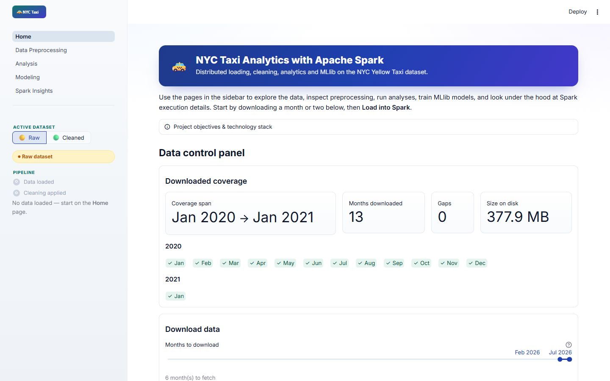
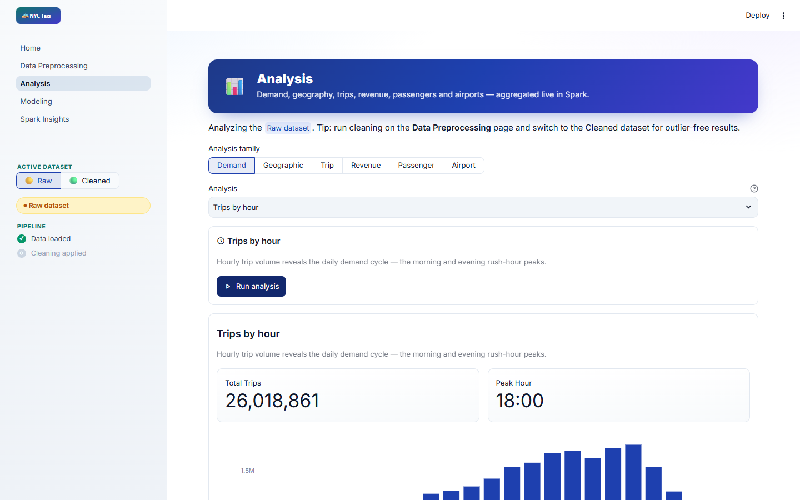
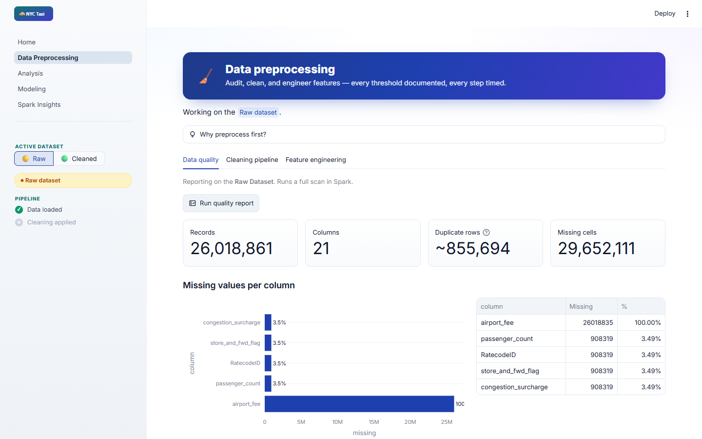

# NYC Taxi Analytics

**Distributed analytics and machine learning on 26M+ NYC Yellow Taxi trips — powered by Apache Spark, wrapped in a Streamlit app you can run with one command.**

Load months of real trip data, clean it with documented rules, run 25 live Spark analyses, and train GPU-accelerated regression models — all from the browser, no notebook required.

<p align="center">
  
</p>

<table>
<tr>
<td width="50%"></td>
<td width="50%"></td>
</tr>
<tr>
<td align="center"><sub>25 live Spark analyses across 6 families</sub></td>
<td align="center"><sub>Full data-quality report on 26M rows</sub></td>
</tr>
</table>

---

## Quick start

The fastest way to run this — no local Python, Java, or Spark install needed:

```bash
docker compose up --build
```

Open **http://localhost:8501**, click **Load into Spark**, and go.

Have an NVIDIA GPU? Train XGBoost on it with one extra flag:

```bash
docker compose -f docker-compose.yml -f docker-compose.gpu.yml up --build
```

<details>
<summary><strong>Prefer running it directly with Python?</strong></summary>

Requires Java 17+ (Spark 4.x) and Python 3.12.

```bash
pip install -r requirements.txt
streamlit run app/Home.py
```

</details>

---

## What it does

| | |
|---|---|
| **Load** | Pull any range of monthly NYC TLC parquet files straight from the Home page — no manual downloads |
| **Clean** | Fixed, documented rules (fare/distance/duration ranges, unknown zones) applied before any train/test split |
| **Analyze** | 25 analyses across demand, geography, trips, revenue, passengers, and airports — every result comes with a chart, metrics, and real execution time |
| **Model** | Spark MLlib regressors plus GPU-capable XGBoost, evaluated on a held-out future time window |
| **Inspect** | A Spark Insights page exposes partitions, execution plans, and cache status under the hood |

Everything runs on one shared `SparkSession` — the UI never touches Spark directly, and the whole pipeline is swappable module-by-module. See [`docs/ARCHITECTURE.md`](../docs/ARCHITECTURE.md) for the layering and [`docs/FEATURES.md`](../docs/FEATURES.md) for the full feature spec.

---

## Configuration

Everything below is optional — sensible defaults are baked in.

| Variable | Default | Purpose |
|---|---|---|
| `NYC_TAXI_DATA_DIR` | `./data` | Where parquet files are read/written |
| `NYC_TAXI_MODELS_DIR` | `./models` | Where trained models are saved |
| `NYC_TAXI_DRIVER_MEMORY` | `4g` | Spark driver heap — lower on a memory-constrained machine |

## Status

Dataset loading, cleaning, data-quality reporting, and all 25 analyses run **real Spark computations** end to end. Modeling (MLlib train/evaluate) is still placeholder-gated behind `config.PLACEHOLDER_MODE` — flip it once you're ready to wire in real training.

## Sanity check

The pure-Python layers (config, timing, mock data, registries) need neither Spark nor Streamlit:

```bash
python smoke_test.py
```
